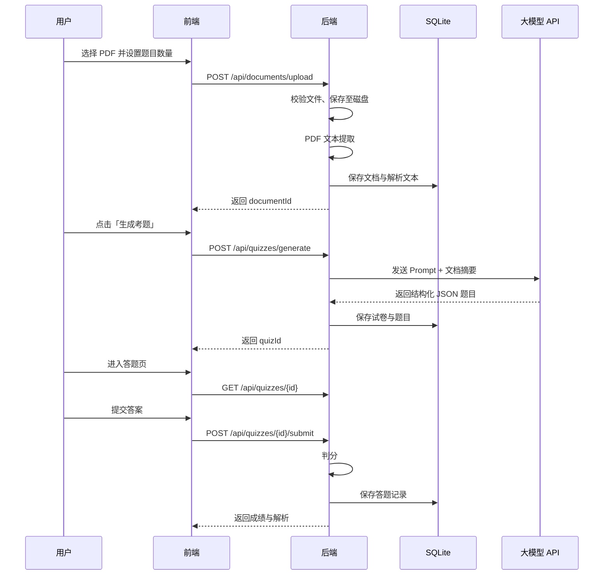

# AI 智能学习平台

基于 PDF 文档自动生成选择题的智能学习平台。用户上传学习资料后，系统解析文档内容并借助大语言模型生成考题，支持在线答题、成绩统计与题目管理。

---

## 1. 项目概述

### 1.1 背景与目标

传统备考依赖人工出题，效率低且覆盖面有限。本平台旨在：

- **自动化出题**：从 PDF 学习材料中抽取知识点，生成高质量选择题
- **闭环学习**：上传 → 生成 → 练习 → 查看解析与成绩
- **轻量部署**：单机 Docker 即可运行，适合个人或小团队使用

### 1.2 目标用户

| 角色 | 描述 |
|------|------|
| 学习者 | 上传 PDF、生成试卷、在线答题、查看成绩与解析 |
| 管理员（可选二期） | 管理用户、查看全局统计 |

首期以**单用户 / 免登录**模式为主，降低实现复杂度；二期可扩展 JWT 认证与多用户隔离。

---

## 2. 功能需求

### 2.1 核心功能（MVP）

| 编号 | 功能 | 描述 | 优先级 |
|------|------|------|--------|
| F-01 | PDF 上传 | 支持 `.pdf` 文件上传，单文件大小上限可配置（默认 20MB） | P0 |
| F-02 | PDF 解析 | 提取文本内容（含分页、段落结构），存储解析结果 | P0 |
| F-03 | 智能出题 | 基于解析文本调用 LLM，生成 N 道选择题（题干 + 4 选项 + 正确答案 + 解析） | P0 |
| F-04 | 试卷管理 | 查看已生成试卷题库、详情、删除 | P0 |
| F-05 | 在线答题 | 逐题或整卷作答，提交后自动判分 | P0 |
| F-06 | 成绩与解析 | 展示得分、错题列表及每题解析 | P0 |
| F-07 | 出题参数配置 | 可配置题目数量、难度倾向、考察范围（章节/全文） | P1 |

### 2.2 扩展功能（二期）

| 编号 | 功能 | 描述 |
|------|------|------|
| F-08 | 用户注册登录 | JWT 认证，数据按用户隔离 |
| F-09 | 题目导出 | 导出为 JSON / Word / PDF |
| F-10 | 错题本 | 收录答错题目，支持重复练习 |
| F-11 | 批量上传 | 多 PDF 合并出题 |
| F-12 | 非 PDF 格式 | 支持 `.docx`、纯文本 |

### 2.3 非功能需求

| 类别 | 要求 |
|------|------|
| 性能 | PDF 解析（10 页内）< 30s；出题（10 题）< 60s（依赖 LLM API） |
| 可用性 | 界面简洁，核心流程 3 步内完成：上传 → 生成 → 答题 |
| 可靠性 | 上传与出题任务失败有明确错误提示，支持重试 |
| 安全 | 上传文件类型校验；API Key 仅存服务端环境变量；防路径遍历 |
| 可维护性 | 前后端分离，RESTful API，Docker 一键启动 |
| 兼容性 | 现代浏览器（Chrome、Firefox、Safari、Edge 最新两个大版本） |

---

## 3. 技术架构

### 3.1 技术栈

| 层级 | 技术 | 说明 |
|------|------|------|
| 前端 | Vue 3 + TypeScript + Vite | Composition API、Pinia 状态管理 |
| UI | Element Plus | 组件库，快速搭建表单与表格 |
| 后端 | Spring Boot 3.x + Java 17 | REST API、异步任务 |
| 数据库 | SQLite | 嵌入式本地库，零运维 |
| ORM | MyBatis-Plus | 实体映射与 CRUD |
| PDF 解析 | Apache PDFBox 或 pdfbox + tabula（表格可选） | 文本提取 |
| AI 出题 | OpenAI 兼容 API（智谱 AI / OpenAI / DeepSeek 等） | 通过 HTTP 调用 |
| 部署 | Docker + Docker Compose | 前后端 + 数据卷持久化 |

### 3.2 系统架构图

```
┌─────────────┐     HTTP/REST      ┌──────────────────┐
│  Vue3 前端   │ ◄──────────────► │  Spring Boot API │
│  (Nginx)    │                   │                  │
└─────────────┘                   │  ┌────────────┐  │
                                  │  │ PDF 解析   │  │
                                  │  └────────────┘  │
                                  │  ┌────────────┐  │
                                  │  │ LLM 出题   │  │
                                  │  └────────────┘  │
                                  │  ┌────────────┐  │
                                  │  │ SQLite     │  │
                                  │  └────────────┘  │
                                  └──────────────────┘
                                           │
                                           ▼
                                    [ LLM API ]
```

### 3.3 目录结构（规划）

```
ai-learning-platform/
├── README.md                 # 本文档
├── plan.md                   # 开发计划
├── docker-compose.yml
├── backend/                  # Spring Boot
│   ├── src/main/java/...
│   ├── src/main/resources/
│   └── Dockerfile
├── frontend/                 # Vue 3
│   ├── src/
│   └── Dockerfile
└── data/                     # SQLite 与上传文件（挂载卷）
    ├── db/
    └── uploads/
```

---

## 4. 业务流程

### 4.1 主流程：上传 PDF 并生成考题



### 4.2 页面规划

| 路由 | 页面 | 功能 |
|------|------|------|
| `/` | 首页 | 平台介绍、快捷入口 |
| `/documents` | 文档列表 | 已上传 PDF、解析状态、删除 |
| `/documents/upload` | 上传页 | 拖拽上传、参数设置 |
| `/quizzes` | 试卷题库 | 已生成试卷、进入答题 |
| `/quizzes/:id` | 答题页 | 展示题目、提交答案 |
| `/quizzes/:id/result` | 成绩页 | 得分、错题、解析 |

---

## 5. 数据模型

### 5.1 ER 关系（MVP）

```
Document (1) ──< (N) Quiz (1) ──< (N) Question
                                    │
QuizAttempt (1) ──< (N) AnswerRecord ┘
```

### 5.2 表结构概要

**document** — 上传的 PDF 文档

| 字段 | 类型 | 说明 |
|------|------|------|
| id | INTEGER PK | 主键 |
| file_name | TEXT | 原始文件名 |
| file_path | TEXT | 存储路径 |
| file_size | INTEGER | 字节数 |
| page_count | INTEGER | 页数 |
| extracted_text | TEXT | 解析后的全文 |
| status | TEXT | PENDING / PARSED / FAILED |
| created_at | DATETIME | 创建时间 |

**quiz** — 试卷

| 字段 | 类型 | 说明 |
|------|------|------|
| id | INTEGER PK | 主键 |
| document_id | INTEGER FK | 关联文档 |
| title | TEXT | 试卷标题 |
| question_count | INTEGER | 题目数量 |
| status | TEXT | GENERATING / READY / FAILED |
| created_at | DATETIME | 创建时间 |

**question** — 题目

| 字段 | 类型 | 说明 |
|------|------|------|
| id | INTEGER PK | 主键 |
| quiz_id | INTEGER FK | 关联试卷 |
| sort_order | INTEGER | 题号 |
| stem | TEXT | 题干 |
| option_a ~ option_d | TEXT | 四个选项 |
| correct_answer | TEXT | A/B/C/D |
| explanation | TEXT | 答案解析 |

**quiz_attempt** — 答题记录

| 字段 | 类型 | 说明 |
|------|------|------|
| id | INTEGER PK | 主键 |
| quiz_id | INTEGER FK | 关联试卷 |
| score | INTEGER | 得分 |
| total | INTEGER | 总分 |
| submitted_at | DATETIME | 提交时间 |

**answer_record** — 每题作答

| 字段 | 类型 | 说明 |
|------|------|------|
| id | INTEGER PK | 主键 |
| attempt_id | INTEGER FK | 关联答题记录 |
| question_id | INTEGER FK | 关联题目 |
| user_answer | TEXT | 用户选择 |
| is_correct | BOOLEAN | 是否正确 |

---

## 6. API 设计（REST）

### 6.1 文档模块

| 方法 | 路径 | 说明 |
|------|------|------|
| POST | `/api/documents/upload` | 上传 PDF（multipart） |
| GET | `/api/documents` | 文档列表 |
| GET | `/api/documents/{id}` | 文档详情 |
| DELETE | `/api/documents/{id}` | 删除文档及关联数据 |

### 6.2 试卷模块

| 方法 | 路径 | 说明 |
|------|------|------|
| POST | `/api/quizzes/generate` | 根据 documentId 生成试卷 |
| GET | `/api/quizzes` | 试卷题库 |
| GET | `/api/quizzes/{id}` | 试卷详情（含题目，答题模式可隐藏答案） |
| DELETE | `/api/quizzes/{id}` | 删除试卷 |

### 6.3 答题模块

| 方法 | 路径 | 说明 |
|------|------|------|
| POST | `/api/quizzes/{id}/submit` | 提交答案，返回成绩 |
| GET | `/api/quizzes/{id}/attempts` | 历史答题记录 |

### 6.4 统一响应格式

```json
{
  "code": 0,
  "message": "success",
  "data": { }
}
```

错误码示例：`400` 参数错误、`404` 资源不存在、`500` 服务器错误、`503` LLM 服务不可用。

---

## 7. AI 出题设计

### 7.1 Prompt 策略

- 输入：文档标题、提取文本（超长时按 token 截断或分段摘要）
- 输出：严格 JSON 数组，每题包含 `stem`、`options`（4 项）、`correctAnswer`、`explanation`
- 约束：题目不重复、选项干扰项合理、答案唯一、解析引用原文

### 7.2 示例输出结构

```json
{
  "questions": [
    {
      "stem": "以下关于 XXX 的描述，正确的是？",
      "options": {
        "A": "选项一",
        "B": "选项二",
        "C": "选项三",
        "D": "选项四"
      },
      "correctAnswer": "B",
      "explanation": "根据文档第 X 段……"
    }
  ]
}
```

### 7.3 可配置项（多提供商并存）

智谱与 DeepSeek 可同时配置，通过 `LLM_PROVIDER` 或 `LLM_MODEL` 决定当前生效平台：

| 环境变量 | 说明 | 默认值 |
|----------|------|--------|
| `LLM_PROVIDER` | `auto` / `zhipu` / `deepseek` | `auto` |
| `LLM_MODEL` | 当前模型（`auto` 时 `glm-*`→智谱，`deepseek-*`→DeepSeek） | 各平台默认模型 |
| `ZHIPU_API_BASE` / `ZHIPU_API_KEY` / `ZHIPU_DEFAULT_MODEL` | [智谱 AI](https://docs.bigmodel.cn/cn/guide/start/quick-start) | 见 `.env.example` |
| `DEEPSEEK_API_BASE` / `DEEPSEEK_API_KEY` / `DEEPSEEK_DEFAULT_MODEL` | [DeepSeek](https://api-docs.deepseek.com/zh-cn/) | 见 `.env.example` |
| `QUIZ_DEFAULT_COUNT` | 默认出题数量 | `10` |
| `QUIZ_MAX_COUNT` | 最大出题数量 | `30` |

启动后可调用 `GET /api/llm/config` 查看当前生效的 provider 与 model。

---

## 8. Docker 部署

### 8.1 服务组成

| 服务 | 镜像/构建 | 端口 | 说明 |
|------|-----------|------|------|
| `backend` | Dockerfile 构建 | 8080 | Spring Boot API |
| `frontend` | Dockerfile 构建 | 80 | Nginx 托管静态资源，反向代理 `/api` |
| 数据卷 | — | — | `./data` 挂载 SQLite 与上传目录 |

### 8.2 环境变量（`.env` 示例）

```env
LLM_PROVIDER=auto
LLM_MODEL=glm-4.7-flash
ZHIPU_API_KEY=your-zhipu-api-key
DEEPSEEK_API_KEY=your-deepseek-api-key
QUIZ_DEFAULT_COUNT=10
```

### 8.3 启动命令

```bash
docker compose up -d --build
```

访问：`http://localhost`（前端），API：`http://localhost/api`。

### 8.4 本地开发快速开始

```bash
# 1. 配置 LLM API Key
cp .env.example .env
# 编辑 .env，填入智谱 API Key（https://bigmodel.cn/usercenter/proj-mgmt/apikeys）

# 2. 启动后端
cd backend
APP_DATA_DIR=../data mvn spring-boot:run

# 3. 启动前端（新终端）
cd frontend
npm install && npm run dev
```

浏览器打开 http://localhost:5173 ，按「上传 PDF → 生成考题 → 答题 → 查看成绩」完成全流程。

---

## 9. 约束与风险

| 风险 | 缓解措施 |
|------|----------|
| PDF 扫描件无文本层 | 首期仅支持可选中文本 PDF；二期接入 OCR |
| LLM 返回格式不稳定 | JSON Schema 校验 + 重试 + 降级提示 |
| 长文档超出模型上下文 | 分段摘要或按页抽样后再出题 |
| SQLite 并发写入 | MVP 单用户足够；高并发时迁移 PostgreSQL |
| API 费用 | 限制出题数量、缓存同文档重复生成 |

---

## 10. 验收标准（MVP）

- [ ] 可上传 PDF 并在列表中看到解析状态
- [ ] 可基于已解析文档一键生成至少 5 道选择题
- [ ] 题目包含题干、四选项、正确答案与解析
- [ ] 可完成整卷答题并显示得分与错题解析
- [ ] `docker compose up` 后前后端可正常访问
- [ ] 重启容器后数据（SQLite、上传文件）不丢失

---

## 11. 参考与许可

- 本项目为学习与演示用途
- 依赖的开源组件遵循各自许可证（Spring Boot、Vue、PDFBox、Element Plus 等）
